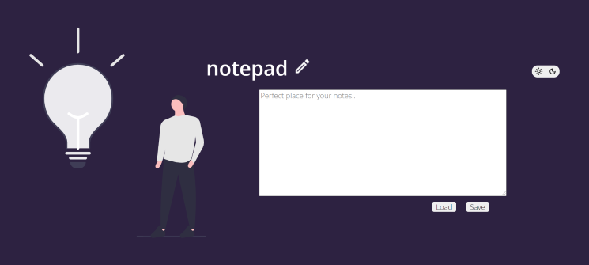

Click the [link](https://kos-tomasz.github.io/notepad/) to use my editor.

# Simple text editor 
You can easily save your notes and load the previous one. Use the button on the up right to switch between dark and light mode.
